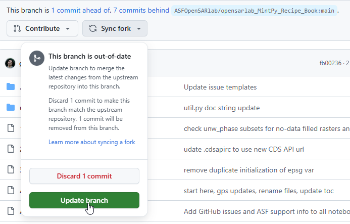

# OpenSARLab Jupyter Books for TAMU-CC HPC

This repository looks to allow users of the [**CREST HPC cluster at Texas A&M University–Corpus Christi**](https://www.tamucc.edu/engineering/departments/computer-science/high-performance-computing/index.php) to set up an OpenSARLab Jupyter Notebook environment while taking advantage of the HPC's processing power.

## Setup

There may be an EarthScope InSAR Docker Image available on the HPC already (as of September 2024, [*Earthscope_InSAR_2024*](https://github.com/ASFOpenSARlab/opensarlab-docker/tree/main) is the latest version); if so, you can skip to **step 5**. However, if you would like to set up a container image from scratch, here is the process:

### Step 1: Cloning

Clone the following repository:
```bash
git clone https://github.com/ASFOpenSARlab/opensarlab-docker.git
```

### Step 2: Build the container

Run the `build.sh` script to build this container. For *Earthscope_InSAR_2024*, the path to this script in the repository is `Earthscope_InSAR_2024/insar/build.sh`

### Step 3: Push to DockerHub

Create a [DockerHub](https://hub.docker.com/) account if you don't have one yet, and create a repository for your image.
Then, retag the image file you created by running the following command, substituting values with the path to the image you created, your username, and your Docker repository name:
```bash
docker tag <local_image_path> your_username/your_repository:latest 
```
Finally, push the image to DockerHub with the following command, substituting values with your username and your Docker repository name:
```bash
docker push your_username/your_repository:latest
```
#### Step 4: Fetch the image on the HPC

Once the image has been pushed to DockerHub, you can navigate to your desired folder on the HPC (on CREST, this will likely be under the `/work` directory), and pull the image with the following command:

```bash
singularity pull docker://<your_docker_username>/<your_repository>:latest
```

#### Step 5: Set up the Jupyter instance

Download the `start_insar_jupyter_instance.sh` file from this repository and place it in the same directory where you ran the last step. Run it as follows:

```bash
./start_insar_jupyter_instance.sh <project_name> <cluster_node_name> <port>
```

substituting with your project name, the name of the specific HPC node to run it on (e.g., `crest-g001`), and the port to run it on. If you're unsure of which port to use, make sure it is in the range 1024 - 49151 ([registered ports](https://en.wikipedia.org/wiki/List_of_TCP_and_UDP_port_numbers#Registered_ports)), and check if it's not being currently used by running the following commands:
```bash
netstat -nlp | grep <your_desired_port>

lsof -i:<your_desired_port>
```
If neither command shows the port's information, it is free to use.

#### Step 6: Access the Jupyter instance from your computer

You can access the Jupyter instance in a browser by first opening a reverse SSH tunnel to that particular port; you can do this on your local machine by issuing the following command:

```bash
ssh -L <local_machine_port>:<cluster_node_name>:<jupyter_instance_port> <islandID>@crest-login
```

for example, if I (`islander101`) want to connect to `crest-g001` through the url `http://127.0.0.1:31613` on my local machine, and I specified the port `9999` in step 5, my command would look like this:

> So long as the ports are available on both your local machine and the HPC, you can use the same port for your local machine and Jupyter instance port. This can make things simpler.
```bash
ssh -L 31613:crest-g001:9999 islander101@crest-login
```


Finally, to access the Jupyter instance on your browser, you will also have to find the URL with the token in your Jupyter logs. You can find it by going to the `logs` folder inside your project folder (created in step 5), and running the following command, substituting the username with your IslandID and the node name with the node you specified in step 5:

```bash
cat insar_jupyer_<your_username>_<cluster_node_name>.log | grep 127.0.0.1
```

for example, if I (`islander101`) want to get my URL for my instance running on crest-g001, I can run the following command to find it:

```bash
cat insar_jupyter_islander101_crest-g001.log | grep 127.0.0.1
```

I can then copy and paste the URL to my browser. If I specified a different port to access the instance from my local machine on, I will have to change the port on the URL; the following example shows this change using the previous example of an instance on port `9999` and a local machine port of `31613`:  
```
On HPC              | http://127.0.0.1:9999/lab?token=abcde...
->
On local machine    | http://127.0.0.1:31613/lab?token=abcde...
```

Finally, you can access the Jupyter instance in your web browser!

## Maintaining this repository

This repository will always be several commits ahead of the upstream [*opensarlab_MintPy_Recipe_Book*](https://github.com/ASFOpenSARlab/opensarlab_MintPy_Recipe_Book/) repository. However, in order to keep up with commits from there while also implementing new changes and improvements for HPC use, follow these steps:

1. Use GitHub's *Sync fork* option on the Git repository page to sync changes from upstream. Do **not** use the "Discard" option unless if you want to lose our progress!
    
2. Make sure your local clone of this repository has the original repository set up as the upstream repository by running this terminal command (this allows you to merge individual changes and branches from upstream to here):
    ```bash
    git remote add upstream https://github.com/ASFOpenSARlab/opensarlab_MintPy_Recipe_Book.git
    ```
3. To pull changes from an individual branch on the upstream repo, you can run this command:
    ```bash
    git merge upstream/<branch_name>
    ```
4. Keep in mind that **opening pull requests in this repository will propose changes to the original OpenSARLab repository!** If you want to merge changes between branches on this fork, you will have to just run `git merge` without a pull request. 
5. Pull changes to a separate branch first *before* merging them into our `main` repository here; just to make sure that we're not bringing in any changes that can break an InSAR run.

---

> The following sections make up the original OpenSARLab Jupyter Book repository README. These are **not** required reading for setting up these Jupyter Books on the CREST HPC (though it does contain useful information!)


# Start Here

This Jupyter Book contains data recipes for loading ASF HyP3 INSAR_GAMMA and INSAR_ISCE_BURST stacks into MintPy and performing Small Baseline Subset (SBAS) line-of-sight, displacement time series analyses. It also provides options for error analysis, plotting, and outputting data to GeoTiff.

## MintPy

>The Miami INsar Time-series software in PYthon (MintPy as /mɪnt paɪ/) is an open-source package for Interferometric Synthetic Aperture Radar (InSAR) time series analysis. It reads the stack of interferograms (coregistered and unwrapped) in ISCE, ARIA, FRInGE, HyP3, GMTSAR, SNAP, GAMMA or ROI_PAC format, and produces three dimensional (2D in space and 1D in time) ground surface displacement in line-of-sight direction
>
>*https://github.com/insarlab/MintPy*

<br>
<div class="alert alert-success">
<font face="Calibri" size="5"><b><font color='rgba(200,0,0,0.2)'> <u>Jupyter Book Navigation</u></font></b></font>

<font face="Calibri" size="3">For an improved Jupyter Book Experience in JupyterLab, try installing the [jupyterlab-jupyterbook-navigation](https://pypi.org/project/jupyterlab-jupyterbook-navigation/) JupyterLab extension.
</font>
</div>


## How To Use This Jupyter Book

>1. ### Install the software environment needed to run the notebooks
>
>    - Run the **Install Required Software with Conda** notebook ([1_Software_Environment.ipynb](1_Software_Environment.ipynb))
>    - Rerun this step periodically. Updates to environment config files will not take effect unless you update or recreate your environment.
>
>1. ### Configure Climate Data Store Access (optional)
>
>    - Run the **Set Up Climate Data Store Access** notebook ([2_CDS_Access.ipynb](2_CDS_Access.ipynb))
>    - Configure CDS access if you will perform tropospheric correction
>    - If you do not wish to perform tropospheric correction, you must set the following config option: `mintpy.troposphericDelay.method = no`
>
>1. ### Access HyP3 Data
>
>    - Run the **Access & Subset HyP3 SBAS Stack (InSAR or Burst-InSAR)** notebook ([3_Access_HyP3_Data.ipynb](3_Access_HyP3_Data.ipynb))
>    - How-to: [order interferograms from HyP3](https://storymaps.arcgis.com/stories/68a8a3253900411185ae9eb6bb5283d3)
>
>1. ### Load Data with MintPy
>
>    - Run the **A. Load HyP3 SBAS Stack into MintPy** notebook ([a_Load_HyP3_Data.ipynb](a_Load_HyP3_Data.ipynb))
>    - Run once per SBAS stack
>  
>1. ### Configure a Time Series Analysis
>
>    - Run the **B. Configure (or Reconfigure) MintPy Time Series Analysis** notebook ([b_Update_Configuration.ipynb](b_Update_Configuration.ipynb))
>    - Run anytime you wish to update the configuration of your time series
>  
>1. ### Perform the Time Series Analysis
>
>    - Run the **C. Perform MintPy Time Series Analysis** notebook ([c_MintPy_Time_Series.ipynb](c_MintPy_Time_Series.ipynb))
>
>1. ### Run Post-Time Series Workflows
>
>    - Error Analysis ([Error_Analysis.ipynb](Error_Analysis.ipynb))
>    - Plotting ([Plots.ipynb](Plots.ipynb))
>    - Output Results to GeoTiff ([Output_GeoTiff.ipynb](Output_GeoTiff.ipynb))
>  
> 1. ### Update Your Configuration and Reprocess the Time Series
>
>    - Use the results of your time series and error analyses to make configuration adjustments and reprocess the time series by repeating steps 5 and 6.


## Practical Notes About Using MintPy
MintPy loads data from any source or processor into two HDF5 datasets:
- `geometryGeo.h5`
- `ifgramStack.h5`

As you run steps in the time series script, `smallbaselineapp.py`, additional HDF5 data sets will be created, which become inputs for following steps.

**You only need to load your data once**
- If you have loaded your times series from a bunch of large GeoTiffs, you can delete them to conserve space after loading your data.
- You will be able to reconfigure and rerun your time series without needing to reload your data.
- If you reconfigure your time series, you must rerun the time series for the updates to take effect.
- Once you have run your time series, until you wish to reconfigure it, you can rerun any data recipes in the `Extras` section without having to rerun the time series. 


